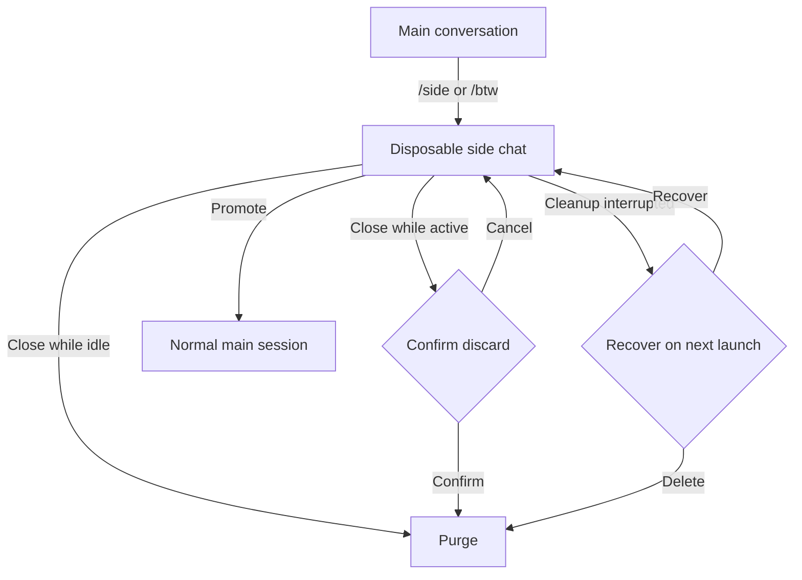
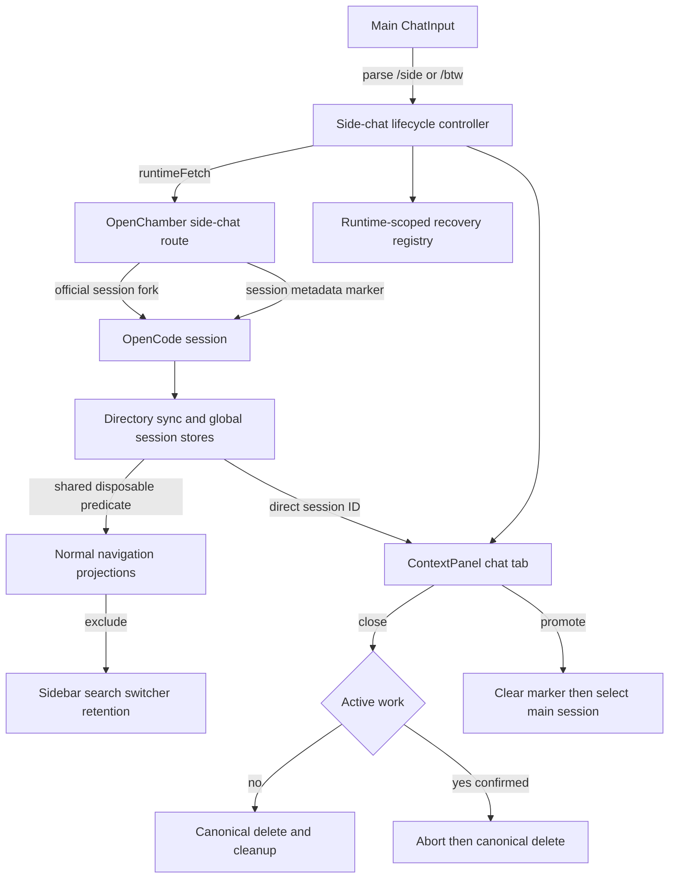

# Disposable Side Chats - Plan

## Goal Capsule

- **Objective:** Let desktop and web users investigate one tangent beside the main conversation without adding that tangent to the main context or durable session history.
- **Authority hierarchy:** Preserve the Product Contract and its R/F/AE IDs; the Planning Contract decides implementation details without weakening purge, recovery, or visibility guarantees.
- **Execution profile:** Implement in the shared web/runtime and UI layers used by browser and Electron, with focused behavior tests before broad static validation.
- **Stop conditions:** Stop rather than ship if a disposable fork can enter normal navigation, purge can report success before authoritative deletion, or runtime identity can target recovery or deletion at the wrong backend.
- **Tail ownership:** The implementation owns localized UI copy, command documentation, focused tests, package checks, browser validation, and cleanup of abandoned experimental code.
- **Open blockers:** None.

---

## Product Contract

### Summary

`/side` and `/btw` open one disposable contextual chat beside the main conversation. The side chat remains hidden from normal session history, is purged when its panel closes, and can be promoted when the user wants to preserve it.

### Problem Frame

Users currently investigate a tangent by manually starting a new session from an answer and archiving it afterward. That workaround interrupts the main workflow and leaves cleanup to the user even when the tangent was intended to be temporary.

### Key Decisions

- **Panel-owned disposable fork:** The side chat is temporary state owned by its panel rather than a normal session temporarily hidden from view. This keeps disposable work out of session history and makes closing the panel an authoritative lifecycle boundary.
- **One side chat at a time:** A main session may have one open side chat in v1. Multiple tabs and nested side chats are deferred.
- **Promotion escape hatch:** A user can preserve a useful side chat by promoting it to a normal session. Promotion closes the side panel and opens the preserved session as the main conversation.
- **Wide-screen first:** V1 covers desktop and web. VS Code, hosted mobile, and Capacitor mobile behavior is deferred.

### Requirements

**Opening and context**

- R1. Entering `/side` or `/btw` from a main conversation must open a side-chat panel with context inherited through the latest completed assistant answer.
- R2. Text following `/side` or `/btw` must be submitted immediately as the first side-chat message.
- R3. A command without trailing text must open the side-chat panel and focus an empty composer.
- R4. The main conversation and side chat must both remain visible and usable while the panel is open.

**Disposable lifecycle**

- R5. The side-chat session must not appear in normal session navigation or search while it remains disposable.
- R6. Closing an idle side-chat panel must purge the disposable session and its associated persisted UI state.
- R7. Closing a side chat with active generation or tool work must ask for confirmation before cancelling and purging that work.
- R8. If normal close cleanup is interrupted, the next launch must offer to recover or delete the abandoned side chat rather than silently promoting or deleting it.

**Preservation and limits**

- R9. The user must be able to promote the open side chat into a normal visible session.
- R10. Promotion must preserve the side chat, close the side panel, and open the promoted session as the main conversation.
- R11. V1 must allow at most one open side chat per main session; another side-chat command must focus the existing chat, and a side chat must not open a nested side chat.

### Key Flows

- F1. Open and ask immediately
  - **Trigger:** The user submits `/side <prompt>` or `/btw <prompt>` from the main conversation.
  - **Steps:** Open a contextual side chat through the latest completed answer, display it beside the main conversation, and submit the trailing prompt.
  - **Outcome:** The tangent proceeds without changing the main conversation context or appearing in normal session history.
  - **Covered by:** R1, R2, R4, R5.
- F2. Open before composing
  - **Trigger:** The user submits `/side` or `/btw` without trailing text.
  - **Steps:** Open the contextual side chat and focus its empty composer.
  - **Outcome:** The user can compose the tangent while retaining the main conversation for reference.
  - **Covered by:** R1, R3, R4, R5.
- F3. Discard the tangent
  - **Trigger:** The user closes the side-chat panel.
  - **Steps:** If work is active, request confirmation; otherwise close immediately. Purge the disposable session and its associated state.
  - **Outcome:** No disposable side-chat session remains in history or persisted state after successful cleanup.
  - **Covered by:** R5, R6, R7.
- F4. Preserve the tangent
  - **Trigger:** The user chooses to promote the side chat.
  - **Steps:** Convert it into a normal visible session, close the panel, and navigate the main conversation to the preserved session.
  - **Outcome:** The side-chat work remains available as an ordinary session.
  - **Covered by:** R9, R10.
- F5. Recover interrupted cleanup
  - **Trigger:** OpenChamber starts with an abandoned disposable side chat from an interrupted prior run.
  - **Steps:** Offer recovery or deletion before treating the session as ordinary history.
  - **Outcome:** The user decides whether the abandoned work survives.
  - **Covered by:** R8.

### Lifecycle

### Acceptance Examples

- AE1. **Covers R1, R2, R4, R5.** Given a completed assistant answer, when the user submits `/side explain that trade-off`, then a side panel opens with context through that answer, the prompt is sent immediately, the main conversation stays usable, and the fork is absent from normal session navigation.
- AE2. **Covers R3.** Given a completed assistant answer, when the user submits `/btw`, then the contextual side panel opens with an empty focused composer and sends no message.
- AE3. **Covers R6.** Given an idle disposable side chat, when the user closes its panel, then the side session and associated persisted UI state are deleted and do not reappear after reload.
- AE4. **Covers R7.** Given a side chat that is generating or running a tool, when the user closes the panel, then OpenChamber asks for confirmation and preserves the open chat if the user cancels.
- AE5. **Covers R9, R10.** Given a useful side chat, when the user promotes it, then it becomes visible in normal session navigation, the side panel closes, and the promoted conversation opens as the main session.
- AE6. **Covers R8.** Given cleanup was interrupted by a crash or browser termination, when OpenChamber next launches, then it offers to recover or delete the abandoned side chat before exposing it as a normal session.
- AE7. **Covers R11.** Given a side chat is already open, when the user invokes another side-chat command from its parent, then OpenChamber focuses the existing side chat without changing its conversation.
- AE8. **Covers R11.** Given the user is composing inside a side chat, when they attempt to invoke `/side` or `/btw`, then OpenChamber does not create a nested disposable chat.

### Success Criteria

- A new side chat receives the same usable conversation context as manually starting a session from the latest completed answer.
- Successfully closing the side panel leaves no disposable session in normal history or persisted state.

### Scope Boundaries

- Multiple simultaneous, tabbed, and nested side chats are deferred. Codex App creates tabbed side chats on repeated invocation; consider that behavior as a v2 candidate.
- VS Code, hosted mobile, and Capacitor mobile support are deferred.
- Closed side chats have no reopen history; preservation requires promotion before normal cleanup completes.
- Bringing a summary or selected messages back into the parent conversation is not part of v1.

### Sources / Research

- Existing focused chat surfaces: `packages/ui/src/components/mini-chat/MiniChatLayout.tsx` and `packages/ui/src/components/layout/ContextPanel.tsx`.
- Existing session fork and deletion behavior: `packages/ui/src/sync/session-actions.ts`.
- Session data and cleanup invariants: `packages/ui/src/sync/DOCUMENTATION.md`.

**Product Contract preservation:** Product Contract unchanged except for this planning note; all R/F/AE IDs and confirmed behavior remain authoritative.

---

## Planning Contract

### Key Technical Decisions

- **Use an OpenChamber-owned lifecycle operation around the official fork API.** The shared server route resolves the requested context boundary, creates the upstream fork, marks it as disposable, and deletes it if marking fails. The UI calls this route through `runtimeFetch`; official session message, abort, update, and delete operations continue through `opencodeClient`.
- **Persist disposability in session metadata and recovery ownership in a runtime-scoped registry.** Session metadata is the durable server-backed identity used after reload, while a small client registry keyed by runtime, normalized directory, parent session ID, and side session ID records opening, open, cleanup-pending, and promotion-pending transitions. Missing or malformed recovery state is failure, not proof that no disposable work exists.
- **Keep disposable sessions addressable but undiscoverable.** Sync and global stores may retain the session records needed for rendering, events, permissions, and deletion, but every normal navigation projection uses one shared `isDisposableSideChat` predicate. This avoids sidebar-only hiding while preserving direct session-ID access for the panel.
- **Make the context panel the lifecycle owner.** A dedicated controller opens or focuses the one side-chat tab, coordinates active-work confirmation, abort-before-delete, promotion, and recovery, then mutates generic panel state only after the lifecycle action succeeds.
- **Reserve `/side` and `/btw` as surface-aware OpenChamber commands.** A shared command definition controls autocomplete and exact-token parsing. These commands are available only in desktop/web main chat, win collisions with project commands, and are absent from mobile, VS Code, scheduled-task, multirun, draft, and embedded side-chat surfaces.
- **Fork from the latest completed assistant message.** The command selects the newest assistant message whose completion timestamp is authoritative and ignores a streaming tail. If no completed answer exists, creation fails without clearing the main composer.
- **Preserve one side chat per parent in v1.** (session-settled: user-approved — chosen over creating tabbed side chats on repeated invocation: focusing the existing chat keeps v1 lifecycle and navigation simple.) A repeated parent command focuses the current side tab; nested invocation is unavailable. Tabbed side chats remain the documented v2 candidate based on Codex App behavior.
- **Delete only after active work is resolved and server deletion is confirmed.** (session-settled: user-approved — chosen over unconditional cancel-and-purge: active generation and tool work must receive a discard confirmation.) Cancellation keeps the panel and registry intact; confirmation aborts active work, waits for an idle/terminal state within a bounded lifecycle, and then uses canonical session deletion cleanup. A failed delete leaves recoverable ownership rather than pretending purge succeeded.
- **Promotion clears disposable authority before navigation.** (session-settled: user-directed — chosen over always losing side-chat contents: useful tangent work must be preservable.) Promotion removes the server metadata marker first, publishes the normal session through existing stores, removes recovery ownership, closes the side panel without deletion, and finally selects the promoted session in the main chat.
- **Tool side effects are not disposable.** Purging conversation state does not undo file edits, commands, network actions, or descendant work. The active-work discard dialog states this boundary and uses existing permission/tool behavior for the side session.

### High-Level Technical Design

The server route is registered before the generic OpenCode proxy in `packages/web/server/lib/opencode/feature-routes-runtime.js`. It uses the active runtime URL and auth dependencies to forward the fork and metadata update without exposing credentials or inventing a second session protocol.

The client lifecycle controller owns ordering but not domain storage. Session deletion remains in `packages/ui/src/sync/session-actions.ts`; generic panel tab mutation remains in `packages/ui/src/stores/useUIStore.ts`; recovery ownership lives in a focused store because it has different subscribers and persistence semantics from generic panel layout.

### State and Failure Invariants

- Session identity is always the tuple of runtime key, normalized directory, and session ID; parent session ID scopes the one-open-side-chat rule but never replaces the authoritative tuple.
- The opening registry entry is written before starting the async lifecycle request and is replaced with the returned side session ID only after the marked fork succeeds.
- A fork or metadata-marking failure restores the command text and leaves attachments, queued messages, inline drafts, and main-session selection untouched.
- A disposable session never becomes discoverable because one event arrived before a later snapshot; create/update events, authoritative snapshots, sidebar ownership, search, switchers, pins, folders, and retention projections all apply the same predicate.
- Closing the panel is not equivalent to hiding it. Escape, tab close, and panel close all use the lifecycle controller; ordinary context-panel tabs keep their current synchronous behavior.
- Cleanup removes panel and recovery state only after deletion succeeds or returns accepted not-found authority. Other failures preserve enough state to retry or recover.
- Hydration cannot overwrite a newer local open, close, or promotion mutation. Runtime switching rejects stale async completions and never acts on another runtime's registry.
- Recovery starts only after runtime selection and authoritative session coverage are available. It offers Recover or Delete for surviving marked sessions and drops a registry entry only when authoritative detail proves the session no longer exists.
- Promotion is idempotent. If marker removal succeeded before interruption, recovery treats the session as normal and clears stale local ownership without deleting it.
- Disposable root deletion relies on the upstream cascade for descendants and then reconciles known child records so a deleted subtree cannot reappear from stale snapshots.

### UI and Command Design

- Reuse the existing context-panel chat iframe and sortable tab chrome. Add a clear disposable label and a quiet Promote action in the panel header; do not create a second panel system.
- Use shared `Button`, `Dialog`, and sprite `Icon` primitives with semantic theme tokens. No Electron-only UI or privileged IPC is required.
- The discard dialog appears only for busy/retry sessions or unresolved permission/question/tool activity. It explains that conversation history will be deleted and external tool side effects will remain.
- The startup recovery dialog lists the abandoned side chat's parent/session label and offers Recover or Delete. Recover opens the same disposable side panel; Delete runs canonical cleanup.
- `/btw` is displayed as an alias of `/side`. Both autocomplete descriptions explain that the chat is deleted on close unless promoted.
- Exact-token parsing accepts case-insensitive `/side` and `/btw` but not prefixes such as `/sidebar`. Trailing multiline text is the first side message; an empty command opens and focuses an empty composer.
- The control command is intercepted before the current submit path clears composer state. On success, only command text consumed by the side chat is cleared; main-chat attachments and unrelated draft state remain with the main composer.

### Runtime Coverage

- **Web:** Full creation, panel, purge, recovery, and promotion behavior through shared UI and web server routes.
- **Electron:** Full behavior through the same in-process OpenChamber server and shared UI; no new main/preload IPC.
- **VS Code:** Command omitted and route not exposed as a supported webview capability in v1.
- **Hosted and Capacitor mobile:** Command omitted in v1; existing chat behavior remains unchanged.
- **Embedded side chat:** `/side` and `/btw` are not executable or advertised, preventing nesting at the command boundary.

### Sequencing

1. Establish metadata, lifecycle route, registry, and discoverability contracts before adding UI entry points.
2. Add command parsing and side-panel opening after direct lifecycle operations are covered by tests.
3. Add close, promotion, and recovery UI after state transitions and rollback behavior are verified without React.
4. Finish localization, docs, broad checks, and browser validation after all behavioral paths are integrated.

### Risks and Mitigations

- **Fork-created event races metadata marking:** The lifecycle route performs fork and marker update as one OpenChamber operation, the opening registry suppresses parent-scoped transient discovery, and marker failure triggers immediate delete. Tests cover event-before-response and snapshot-before-marker orderings.
- **Deletion races stale bootstrap:** Existing mutation revisions and deletion tombstones remain authoritative; new tests prove older responses cannot resurrect the side session or descendants.
- **Broad filtering adds render cost:** Use one O(1) metadata predicate at existing projection boundaries, not repeated global scans or a new high-frequency subscription.
- **Generic panel close bypasses purge:** All disposable close affordances route through one controller, while generic tabs retain existing behavior. Tests exercise Escape, panel close, and tab close.
- **Recovery under the wrong runtime:** Registry keys include runtime identity and async commits recheck the active runtime before mutation.
- **User mistakes purge for rollback:** Discard copy names the retained tool side effects, and promotion remains available before closing.

---

## Implementation Units

### U1. Disposable session identity and lifecycle route

- **Goal:** Provide a server-backed operation that creates a fork through the latest completed answer, marks it disposable, and fails without leaving an ordinary orphan session.
- **Requirements:** R1, R5, R8, R9, R10.
- **Files:** `packages/web/server/lib/side-chats/routes.js` (new), `packages/web/server/lib/side-chats/routes.test.js` (new), `packages/web/server/lib/opencode/feature-routes-runtime.js`, `packages/ui/src/lib/opencode/sideChatMetadata.ts` (new), `packages/ui/src/lib/opencode/sideChatMetadata.test.ts` (new), `packages/ui/src/lib/runtime-fetch.ts` (pattern only).
- **Approach:** Add namespaced metadata helpers for disposable identity, parent ID, and promotion. Register an authenticated OpenChamber route before the generic proxy that validates directory/session/message inputs, invokes the upstream fork, patches metadata, returns the marked session, and deletes the fork on patch failure. Add promotion support that removes only side-chat metadata while preserving unrelated metadata.
- **Test scenarios:** successful marked fork; latest completed message input accepted; invalid/missing identity rejected; upstream fork failure; marker update failure followed by delete; delete cleanup failure surfaced distinctly; promotion preserves unrelated metadata; repeated promotion is idempotent; auth and directory query forwarding remain intact.
- **Verification:** `bun test packages/web/server/lib/side-chats/routes.test.js packages/ui/src/lib/opencode/sideChatMetadata.test.ts`.

### U2. Runtime-scoped recovery and discoverability contracts

- **Goal:** Keep disposable sessions available to their panel while excluding them from every normal session-discovery path and preserving recoverable lifecycle state.
- **Requirements:** R5, R6, R8, R11.
- **Dependencies:** U1.
- **Files:** `packages/ui/src/stores/useDisposableSideChatsStore.ts` (new), `packages/ui/src/stores/useDisposableSideChatsStore.test.ts` (new), `packages/ui/src/sync/session-event-router.ts`, `packages/ui/src/sync/__tests__/sync-context-session-events.test.ts`, `packages/ui/src/sync/event-reducer.ts`, `packages/ui/src/sync/__tests__/event-reducer.test.ts`, `packages/ui/src/stores/useGlobalSessionsStore.ts`, `packages/ui/src/stores/useGlobalSessionsStore.test.ts`, `packages/ui/src/components/session/sidebar/sessionOwnership.ts`, `packages/ui/src/components/session/sidebar/sessionOwnership.test.ts`, `packages/ui/src/components/session/SessionSwitcherDropdown.tsx`, `packages/ui/src/components/session/sidebar/DOCUMENTATION.md`, `packages/ui/src/stores/DOCUMENTATION.md`, `packages/ui/src/sync/DOCUMENTATION.md`.
- **Approach:** Add a bounded, versioned recovery registry keyed by runtime/directory/parent/side session. Centralize the disposable predicate and apply it at store reconciliation and navigation projection boundaries without removing direct-ID renderability. Reconcile hydration against newer local mutations, reset authority on runtime switch, and expose focused selectors/actions for opening, cleanup-pending, promotion-pending, recovery, and completion.
- **Test scenarios:** event-before-route-response never enters discoverable lists; authoritative snapshots keep disposable sessions hidden; ordinary sessions remain unchanged; search/switcher/sidebar/retention projections exclude disposable records; direct session-ID loading still works; one chat per parent focuses existing ownership; missing versus empty registry; malformed payload; hydration race; stale runtime completion; cleanup-pending survives reload; successful not-found reconciliation clears only matching ownership; deletion tombstone prevents resurrection.
- **Verification:** `bun test packages/ui/src/stores/useDisposableSideChatsStore.test.ts packages/ui/src/sync/__tests__/sync-context-session-events.test.ts packages/ui/src/sync/__tests__/event-reducer.test.ts packages/ui/src/stores/useGlobalSessionsStore.test.ts packages/ui/src/components/session/sidebar/sessionOwnership.test.ts`.

### U3. Side command parsing and direct-session send

- **Goal:** Make `/side` and `/btw` reliable desktop/web control commands that preserve main composer state on failure and immediately send trailing text to the fork.
- **Requirements:** R1, R2, R3, R11.
- **Dependencies:** U1, U2.
- **Files:** `packages/ui/src/components/chat/openChamberCommands.ts` (new), `packages/ui/src/components/chat/openChamberCommands.test.ts` (new), `packages/ui/src/components/chat/CommandAutocomplete.tsx`, `packages/ui/src/components/chat/ChatInput.tsx`, `packages/ui/src/sync/session-actions.ts`, `packages/ui/src/sync/session-actions.test.ts`, `packages/ui/src/components/layout/contextPanelEmbeddedChat.ts`, `packages/ui/src/components/layout/contextPanelEmbeddedChat.test.ts`.
- **Approach:** Extract surface-aware OpenChamber command definitions used by autocomplete and submit parsing. Intercept exact side commands before composer consumption, locate the latest completed assistant message from authoritative session state, invoke the lifecycle controller, save the current model/agent selection for the side session, and send trailing text through the existing optimistic explicit-session send path. Empty commands open/focus only; failure restores the original text and leaves other composer state untouched.
- **Test scenarios:** command discovery only on desktop/web main chat; aliases and case-insensitive exact tokens; `/sidebar` fallback; project-command collision precedence and dedupe; multiline trailing prompt; empty command; no completed answer; streaming tail chooses previous completion; repeated invocation focuses existing; embedded invocation rejected; creation/send failure restores text; attachments, queue, mentions, and inline drafts remain on the main composer.
- **Verification:** `bun test packages/ui/src/components/chat/openChamberCommands.test.ts packages/ui/src/components/layout/contextPanelEmbeddedChat.test.ts packages/ui/src/sync/session-actions.test.ts`.

### U4. Panel lifecycle, promotion, and recovery UI

- **Goal:** Deliver the side-by-side interaction with authoritative close, purge, promotion, and startup recovery behavior.
- **Requirements:** R4, R6, R7, R8, R9, R10, R11.
- **Dependencies:** U1, U2, U3.
- **Files:** `packages/ui/src/components/layout/disposableSideChatLifecycle.ts` (new), `packages/ui/src/components/layout/disposableSideChatLifecycle.test.ts` (new), `packages/ui/src/components/layout/ContextPanel.tsx`, `packages/ui/src/stores/useUIStore.ts`, `packages/ui/src/stores/useUIStore.contextPanel.test.ts`, `packages/ui/src/App.tsx`, `packages/ui/src/components/layout/DisposableSideChatRecoveryDialog.tsx` (new), `packages/ui/src/components/ui/dialog.tsx` (pattern only), `packages/ui/src/components/ui/button.tsx` (pattern only).
- **Approach:** Add explicit disposable tab identity to context-panel state and a lifecycle coordinator shared by tab close, panel close, and Escape. Detect active work from authoritative status plus unresolved permission/question state, show the discard dialog when needed, abort before canonical deletion, and keep the panel open on cancel or failure. Promotion clears metadata before closing/selecting. Startup reconciliation presents one recovery dialog per abandoned ownership record and opens or deletes through the same controller.
- **Test scenarios:** main and side chats remain interactive; idle close purges; busy/retry/pending permission/question close confirms; cancel preserves; confirm aborts then deletes; deletion failure keeps recovery state and visible error; Escape/tab/panel close share ordering; promotion publishes before navigation and never deletes; interrupted promotion recovers as normal; recover reopens side tab; delete clears only matching runtime identity; ordinary context-panel tabs retain existing close behavior; no nested/second disposable tab.
- **Verification:** `bun test packages/ui/src/components/layout/disposableSideChatLifecycle.test.ts packages/ui/src/stores/useUIStore.contextPanel.test.ts` plus browser interaction coverage for opening, parallel use, close confirmation, promotion, reload recovery, and narrow-window behavior.

### U5. Localized copy, documentation, and integration hardening

- **Goal:** Finish all user-visible copy, command documentation, ownership documentation, and end-to-end regression coverage.
- **Requirements:** R1-R11.
- **Dependencies:** U1-U4.
- **Files:** `packages/ui/src/lib/i18n/messages/en.ts`, every peer locale file under `packages/ui/src/lib/i18n/messages/`, `packages/docs/content/docs/commands-snippets.mdx`, `packages/ui/src/sync/DOCUMENTATION.md`, `packages/ui/src/stores/DOCUMENTATION.md`, `packages/ui/src/components/session/sidebar/DOCUMENTATION.md`, and focused integration tests identified by U1-U4.
- **Approach:** Add translated command descriptions, disposable label, Promote action, active-discard warning, recovery actions, and failure copy in every locale. Document OpenChamber control commands separately from reusable prompt commands and record lifecycle/store ownership invariants. Add integration fixtures for event ordering, runtime switches, stale bootstrap, descendant cleanup, and promotion persistence.
- **Test scenarios:** every locale contains every new key with non-English translations; command docs match availability; no hardcoded user-facing English; stale events and snapshots cannot expose or resurrect disposable sessions; promoted sessions remain visible after reload; purged sessions remain absent after reload; tool-side-effect warning appears only on destructive close.
- **Verification:** focused tests from U1-U4, `bun run docs:validate`, `bun run type-check:ui`, `bun run lint:ui`, `bun run type-check:web`, `bun run lint:web`, and `bun run dead-code`.

---

## Verification Contract

| Scope | Command or check | Proves |
|---|---|---|
| Server lifecycle | `bun test packages/web/server/lib/side-chats/routes.test.js` | Fork/mark/delete transaction, promotion, validation, and failure cleanup |
| Metadata and registry | `bun test packages/ui/src/lib/opencode/sideChatMetadata.test.ts packages/ui/src/stores/useDisposableSideChatsStore.test.ts` | Marker semantics, persisted identity, hydration ordering, runtime isolation |
| Sync and visibility | `bun test packages/ui/src/sync/__tests__/sync-context-session-events.test.ts packages/ui/src/sync/__tests__/event-reducer.test.ts packages/ui/src/stores/useGlobalSessionsStore.test.ts packages/ui/src/components/session/sidebar/sessionOwnership.test.ts` | No event/snapshot leakage or stale resurrection |
| Commands and sends | `bun test packages/ui/src/components/chat/openChamberCommands.test.ts packages/ui/src/sync/session-actions.test.ts packages/ui/src/components/layout/contextPanelEmbeddedChat.test.ts` | Parsing, surface gating, context boundary, immediate send, rollback |
| Panel lifecycle | `bun test packages/ui/src/components/layout/disposableSideChatLifecycle.test.ts packages/ui/src/stores/useUIStore.contextPanel.test.ts` | Close guards, purge ordering, promotion, recovery, generic-tab regression |
| Package correctness | `bun run type-check:ui && bun run lint:ui && bun run type-check:web && bun run lint:web` | Shared UI/web types and lint contracts |
| Exports and files | `bun run dead-code` | New files/imports/exports remain reachable; report inspected because the command is non-blocking |
| Documentation | `bun run docs:validate` | Command documentation structure and links remain valid |
| Runtime behavior | Browser tests on web plus Electron smoke run | Side-by-side usability, focus, responsive width, dialogs, reload recovery, and shared-runtime parity |

Browser validation must cover desktop width and a constrained width where the existing context panel reaches its minimum. It must verify the main composer remains usable while the side chat streams, hidden/closed panels do no background UI work beyond authoritative session sync, and no disposable row flashes in sidebar search during create/update event races.

---

## Definition of Done

- R1-R11 and AE1-AE8 are traced to passing focused tests or browser scenarios.
- `/side` and `/btw` are available only in desktop/web main chat, send trailing text immediately, and focus the existing side chat on repeated invocation.
- Side chats inherit through the latest completed assistant answer and never alter the parent conversation context.
- Disposable sessions remain absent from normal sidebar, search, switcher, folder, pin, and retention surfaces across create events, snapshots, reloads, and runtime switches.
- Idle close purges authoritatively; active close confirms, aborts, and purges; failure remains visible and recoverable.
- Promotion clears disposable identity before opening the preserved session as the main chat and survives reload.
- Startup offers Recover or Delete for abandoned marked side chats without acting across runtime identities.
- User-facing copy is translated in every locale and uses shared theme, button, dialog, and icon primitives.
- Owning sync, store, sidebar, and command documentation reflects the final lifecycle and boundaries.
- Focused tests, UI/web type-check and lint, docs validation, dead-code inspection, web browser scenarios, and Electron smoke validation pass.
- No abandoned implementation attempts, temporary flags, duplicate command lists, debug logging, or orphaned sessions remain in the final diff.
